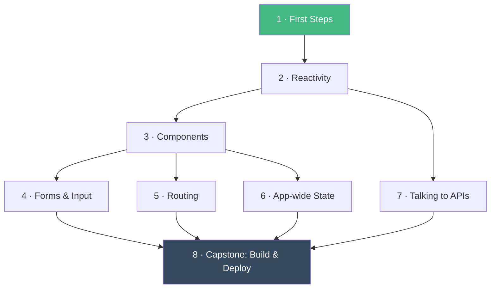

# Vue 3: From Zero to a Deployed App

> **By the end of this course you'll build, and put live on the internet, a complete small Vue app - components, pages, shared state, and real API data - written the way Vue is written today (Vue 3, `<script setup>`, Vite).**

No prior framework experience needed. You just need to be comfortable with HTML, CSS, and basic JavaScript.

## 🗺️ Course map

Arrows show what each module builds on. After Module 3 the path **branches** - modules 4, 5, 6 and 7 don't depend on each other, so take them in whatever order looks most interesting. They all meet again at the capstone.

## 📦 Modules

| # | Module | What you'll be able to do | Status |
|---|--------|---------------------------|--------|
| 1 | [First Steps](./module-01-first-steps/) | Create a Vue project, understand what's in it, and make your first reactive page | ✅ Written |
| 2 | [Reactivity](./module-02-reactivity/) | Model changing data with `ref`, `computed`, and `watch` - Vue's core superpower | 📝 Planned |
| 3 | [Components](./module-03-components/) | Split a UI into reusable pieces that talk to each other (props, events, slots) | 📝 Planned |
| 4 | [Forms & Input](./module-04-forms-and-input/) | Capture and validate user input with `v-model` | 📝 Planned |
| 5 | [Routing](./module-05-routing/) | Turn one page into a multi-page app with Vue Router | 📝 Planned |
| 6 | [App-wide State](./module-06-app-wide-state/) | Share data between distant components with Pinia | 📝 Planned |
| 7 | [Talking to APIs](./module-07-talking-to-apis/) | Fetch real data, and handle loading and error states gracefully | 📝 Planned |
| 8 | [Capstone: Build & Deploy](./module-08-capstone/) | Combine everything into one small app and deploy it publicly | 📝 Planned |

> [!TIP]
> Planned modules have their learning goals written up already - open one to see what's coming. When you reach it, just ask Claude to *"write module N of the Vue course"*.

## ✅ Progress

Tick modules off as you complete them (edit this file on GitHub and click the checkboxes):

- [ ] Module 1 · First Steps
- [ ] Module 2 · Reactivity
- [ ] Module 3 · Components
- [ ] Module 4 · Forms & Input
- [ ] Module 5 · Routing
- [ ] Module 6 · App-wide State
- [ ] Module 7 · Talking to APIs
- [ ] Module 8 · Capstone

## 🧰 What you'll need

- **Node.js 20+** and a terminal
- **VS Code** with the [Vue (official) extension](https://marketplace.visualstudio.com/items?itemName=Vue.volar)
- A browser - that's it

➡️ **Start here: [Module 1 · First Steps](./module-01-first-steps/)**
