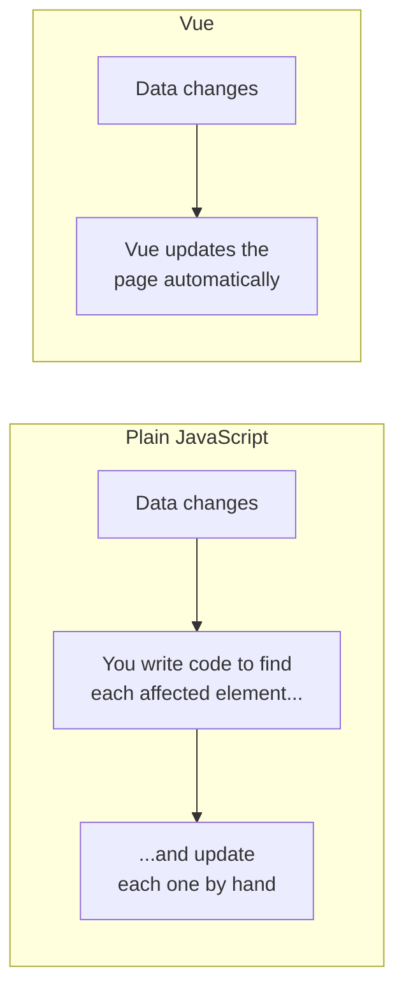

# 1 · Why Vue?

> **You'll learn:** what problem Vue actually solves, so everything you meet later makes sense instead of feeling like magic.

## Why this matters

You can already build a web page with HTML, CSS and JavaScript. But try building a page where *lots of things change* - a cart total that updates as items are added, a list that filters as you type - and plain JavaScript gets painful fast. Vue exists to remove exactly that pain.

## The big picture

With plain JavaScript, **you** are responsible for updating the page every time data changes. With Vue, you just change the data - Vue updates the page.



Concretely - a counter, both ways:

```html
<!-- Plain JS: manually keep the page in sync -->
<p id="count">0</p>
<button id="btn">Add</button>
<script>
  let count = 0
  document.getElementById('btn').addEventListener('click', () => {
    count++
    document.getElementById('count').textContent = count  // manual sync 😩
  })
</script>
```

```vue
<!-- Vue: describe the page, change the data, done -->
<script setup>
import { ref } from 'vue'
const count = ref(0)
</script>

<template>
  <p>{{ count }}</p>
  <button @click="count++">Add</button>
</template>
```

In the Vue version there's no "find the element and update it" code at all. The template *declares* what the page looks like for any value of `count`; changing `count` is enough. This idea is called **reactivity**, and it's the single most important concept in the course.

## What Vue is (in three bullets)

- **A JavaScript framework** - a library plus a set of conventions for building interactive pages.
- **Component-based** - you build small self-contained pieces (a button, a card, a menu) and compose them into an app. That `.vue` file above is a component.
- **Reactive** - you change data, Vue changes the page.

> [!NOTE]
> You'll see two styles of Vue code in the wild: the modern **Composition API** with `<script setup>` (what we just used, and what this whole course teaches) and the older **Options API** (`data()`, `methods:` ...). If a tutorial shows `export default { data() {...} }`, it's the old style - fine to read, but write the modern way.

<details>
<summary>🔍 Deep dive: why not React? (and does it matter?)</summary>

React, Vue, Svelte and Angular all solve the same core problem. Vue's trade-offs: templates look like HTML you already know, reactivity is automatic (React makes you call setter functions), and the official docs are excellent. Skills transfer heavily between frameworks - learning Vue well makes React roughly 70% learned. Don't agonise over the choice.

</details>

## 🛠️ Try it - no install needed

Open the **[Vue Playground](https://play.vuejs.org)** - a full Vue environment in your browser.

1. You'll see a working "Hello World". Find the line `const msg = ref('Hello World!')` and change the text. Watch the page update as you type.
2. Add a button under the `<h1>`: `<button @click="msg = msg + '!'">More!!</button>` - click it a few times.
3. Break something on purpose (delete a `>` somewhere) and read the error. Getting comfortable with error messages now pays off all course long.

## ✋ Checkpoint

1. In the Vue counter above, no code updates the `<p>` element. What updates it, and when?
2. You change `count` from 5 to 6 in your code. What does *your* code have to do next to keep the page correct?

<details>
<summary>Answers</summary>

1. Vue does, automatically, whenever `count` changes - because the template declares `{{ count }}`, Vue knows that spot depends on `count`.
2. Nothing. That's the whole point - the template already describes the page for any value of `count`.

</details>

## 📚 Further reading

- [Introduction - Vue docs](https://vuejs.org/guide/introduction.html) - the official "what is Vue", short and well written
- [Vue Playground](https://play.vuejs.org) - keep this bookmarked; it's the fastest place to test ideas all through the course

---

🗺️ [Course map](../README.md) · ➡️ [Next: Your First Project](./02-your-first-project.md)
