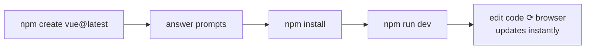

# 2 · Your First Project

> **You'll learn:** how to create a real Vue project on your machine, what every file in it is for, and how the instant-reload dev workflow feels.

## Why this matters

The Playground is great for snippets, but real apps live in a project: many files, a dev server, a build step. Every Vue app you ever build starts exactly the way this lesson does - so this setup becomes muscle memory.

## The big picture

One command scaffolds everything:

```bash
npm create vue@latest
```

It asks a few questions, generates a project, and gives you a dev server that reloads the browser the instant you save a file. The whole loop:



## Create the project

In your terminal, from wherever you keep code:

```bash
npm create vue@latest
```

Answer the prompts like this for now:

| Prompt | Choose | Why |
|---|---|---|
| Project name | `vue-sandbox` | This is your course scratch project |
| TypeScript? | **No** | One new thing at a time - we'll stick to JavaScript |
| JSX / Router / Pinia / testing / ESLint...? | **No** to all | We'll add each of these *when the course reaches it*, so you know what each one is for |

Then:

```bash
cd vue-sandbox
npm install
npm run dev
```

Open the URL it prints (usually `http://localhost:5173`) - you should see a Vue welcome page. **Leave the dev server running**; you never restart it during normal work.

> [!TIP]
> `npm run dev` is powered by **Vite** (French for "fast", said *veet*) - the build tool behind modern Vue. You rarely interact with it directly; just know that's what's serving your app.

## Tour of the files

Only a handful of files matter day to day:

```
vue-sandbox/
├── index.html          ← the single real HTML page (barely ever touched)
├── package.json        ← project config & the "dev"/"build" commands
├── vite.config.js      ← build tool config (ignore for now)
└── src/                ← ⭐ where you actually work
    ├── main.js         ← starts Vue, plugs App into index.html
    ├── App.vue         ← the root component - the whole visible app
    ├── components/     ← your reusable pieces go here
    └── assets/         ← CSS, images
```

The chain that puts pixels on screen: `index.html` has an empty `<div id="app">` → `main.js` tells Vue to render `App.vue` into it → `App.vue` contains everything you see.

> [!NOTE]
> A `.vue` file is a **Single-File Component (SFC)** - one file holding a component's logic (`<script setup>`), markup (`<template>`) and styles (`<style>`) together. You saw one in the Playground; now they're real files.

## 🛠️ Try it

With the dev server running:

1. Open `src/App.vue`, delete its entire contents, and replace with:
   ```vue
   <template>
     <h1>Steve's Vue Sandbox</h1>
     <p>Day 1 of the course.</p>
   </template>
   ```
   Save - the browser updates before you can reach for the refresh button.
2. Add a `<style>` block below the template and make the `h1` your favourite colour. Save, watch it change.
3. Deliberately misspell `</template>` and look at the error overlay in the browser - then fix it. (Vite's error overlays are genuinely helpful; don't fear them.)

<details>
<summary>✅ What step 2 should look like</summary>

```vue
<template>
  <h1>Steve's Vue Sandbox</h1>
  <p>Day 1 of the course.</p>
</template>

<style>
h1 {
  color: #42b883; /* Vue green, obviously */
}
</style>
```

</details>

## ✋ Checkpoint

1. Which file would you edit to change what's visible on the page - `index.html` or `App.vue`?
2. You've saved a change but the browser hasn't updated. What's the *first* thing to check?

<details>
<summary>Answers</summary>

1. `App.vue` - `index.html` is just the empty shell Vue mounts into; the visible app lives in components.
2. Is the dev server (`npm run dev`) still running in your terminal? No server, no reload.

</details>

## 📚 Further reading

- [Quick Start - Vue docs](https://vuejs.org/guide/quick-start.html) - the official version of this lesson
- [Vite - Why Vite](https://vite.dev/guide/why.html) - only if you're curious what the build tool actually does

---

⬅️ [Previous: Why Vue?](./01-why-vue.md) · 🗺️ [Course map](../README.md) · ➡️ [Next: Templates & Reactivity](./03-templates-and-reactivity.md)
