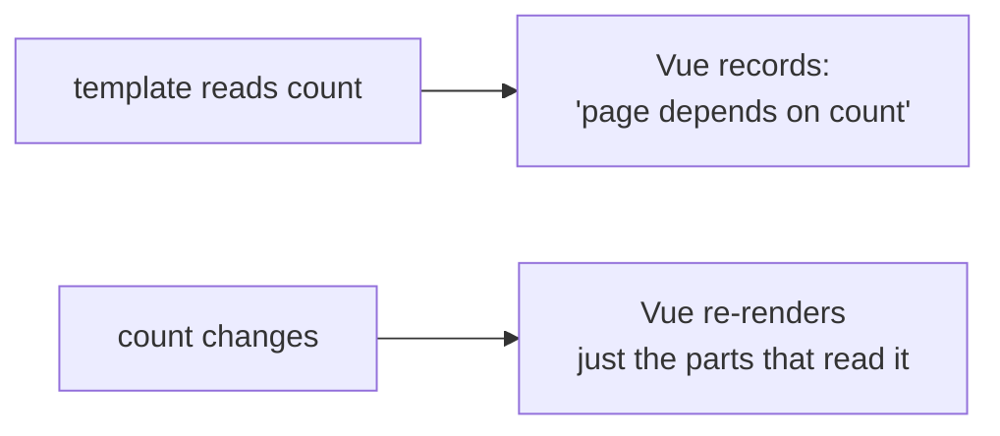

# 2 · ref vs reactive - and why `.value` exists at all

> **You'll learn:** what `ref` actually is under the hood, when `reactive` is the alternative, and how to avoid the three classic ways of accidentally breaking reactivity.

## Why this matters

"`ref` or `reactive`?" is the most-asked question in Vue, and the bugs from getting it wrong are the worst kind: no error, no warning, the page just silently stops updating. Ten minutes of understanding *why* `.value` exists buys you immunity to the whole bug family.

## The big picture

Vue's reactivity is a tracking system. When the template reads a value, Vue records "this part of the page depends on that value". When the value changes, Vue re-renders exactly the parts that depend on it:



The catch: to *record* reads and *notice* writes, Vue needs to intercept them - and JavaScript can only intercept property access on **objects**, never plain variable assignment. That single language fact explains everything on this page.

## What a ref really is

```js
const count = ref(0)
console.log(count)        // { value: 0 }  (roughly)
```

`ref(0)` returns an **object with one property**, `.value` - because a property read/write is something Vue *can* intercept. `count.value++` triggers the tracking machinery; a hypothetical bare `count++` on a plain variable would be invisible to Vue. **`.value` is not a quirk - it's the price of reactivity in JavaScript**, and templates only hide it because Vue unwraps refs there for you.

This also finally explains Module 1's warning about the classic bug:

```js
const count = ref(0)
function add() { count++ }   // ❌ no error at first glance - but this mangles the
                             //    container object instead of changing the number,
                             //    and Vue sees nothing. count.value++ is the fix.
```

## reactive: the object-flavoured alternative

For objects, JavaScript *does* allow interception (via Proxy) - so Vue offers `reactive()`, which makes an object's own properties reactive, no `.value` anywhere:

```js
import { reactive } from 'vue'

const game = reactive({ score: 0, level: 1 })

game.score += 10          // just property access - tracked automatically
```

```html
<p>Score: {{ game.score }} (level {{ game.level }})</p>
```

Nice to read - but `reactive` comes with real limitations that `ref` doesn't have:

| | `ref` | `reactive` |
|---|---|---|
| Works with | **anything** - numbers, strings, booleans, objects, arrays | objects and arrays only |
| Access via | `.value` in script | plain properties |
| Replace the whole thing | ✅ `user.value = newUser` | ❌ reassignment breaks tracking |
| Destructure safely | n/a (one `.value`) | ❌ destructured values go dead |

## The gotcha clinic

The two ways `reactive` silently breaks, worth seeing once each so you recognise the symptom:

```js
const game = reactive({ score: 0 })

// Gotcha 1: replacing the object
game = reactive({ score: 100 })      // ❌ error if const... but even with let:
// the template is still watching the OLD object - page frozen forever

// Gotcha 2: destructuring
let { score } = game                 // score is now a plain, dead number
score++                              // ❌ game.score unchanged, nothing re-renders
```

Both have the same root cause: reactivity lives in the *proxy object*, and both moves walk away from it. `ref` dodges the first entirely (`thing.value = replacement` keeps the container) - which leads to the course's simple policy:

> [!TIP]
> **Default to `ref` for everything.** It handles every type, survives replacement, and the `.value` you pay is also an honest little signpost reading "this is reactive". Reach for `reactive` when a group of fields genuinely belongs together (a form object, game state) and you'll never need to replace it wholesale. Plenty of professional teams write Vue with refs only - you'll never be wrong.

<details>
<summary>🔍 Deep dive: the machinery has names - Proxy and effects</summary>

`reactive()` wraps your object in a JavaScript **Proxy** - a standard language feature (ES2015) that lets code run on every property get/set. On *get*, Vue records which "effect" (a template render, a computed formula, a watcher) is currently running - that's dependency tracking. On *set*, Vue looks up every effect that ever read that property and re-runs them. A `ref` is a small class instance whose `value` getter/setter does the same two jobs; for object contents, `ref` actually calls `reactive` internally - which is why `items.value.push(...)` in Module 1 worked without ceremony.

You can watch the machinery think: in the Playground, add `console.log('rendering!')` at the top of a computed - it logs once, then only again when a dependency changes. That's the effect re-running, and the caching from lesson 1, live.

</details>

## 🛠️ Try it - the Gotcha Clinic

Three broken components. For each: paste into the [Playground](https://play.vuejs.org), confirm it's broken, diagnose *out loud*, then fix it. (Diagnosis before fix - that's the skill being trained.)

**Patient 1** - button does nothing:

```vue
<script setup>
import { ref } from 'vue'
const clicks = ref(0)
function add() { clicks + 1 }
</script>
<template>
  <button @click="add">{{ clicks }}</button>
</template>
```

**Patient 2** - shows the name, but the button never changes it:

```vue
<script setup>
import { reactive } from 'vue'
const user = reactive({ name: 'Anonymous' })
let { name } = user
function rename() { name = 'Grace' }
</script>
<template>
  <p>{{ name }}</p>
  <button @click="rename">I am Grace</button>
</template>
```

**Patient 3** - "New game" leaves the score on screen frozen:

```vue
<script setup>
import { reactive } from 'vue'
let game = reactive({ score: 0 })
function play() { game.score += 10 }
function newGame() { game = reactive({ score: 0 }) }
</script>
<template>
  <p>Score: {{ game.score }}</p>
  <button @click="play">Play</button>
  <button @click="newGame">New game</button>
</template>
```

<details>
<summary>💡 Hint</summary>

Each patient is one of this lesson's three illnesses: a missing `.value` (and a missing assignment!), a destructure, a replacement. Match symptom to section.

</details>

<details>
<summary>✅ Diagnoses and fixes</summary>

1. Two bugs in one line: no `.value`, and `clicks + 1` computes a number and throws it away. Fix: `clicks.value++` (or `clicks.value = clicks.value + 1`).
2. Destructuring `user` copied `name` out as a dead plain string. Fix: drop the destructure and use `user.name = 'Grace'` (template: `{{ user.name }}`) - or make it `const name = ref('Anonymous')` and use `.value`. Both restore the connection.
3. `newGame` replaces the proxy; the template still watches the old one. Idiomatic fix: keep the object, reset its *contents* - `game.score = 0`. (Or switch to `const game = ref({ score: 0 })` and `game.value = { score: 0 }` - ref containers survive replacement, which is exactly the course-policy argument.)

</details>

## ✋ Checkpoint

1. In one sentence: why does `ref` require `.value` in script code?
2. Predict what renders after both clicks: `const n = ref(5)`, button A runs `n.value = 10`, button B runs `n = ref(20)`. Click A, then B - what does `{{ n }}` show, and what happened at B?
3. A teammate proposes "let's use `reactive` for everything so we never type `.value`". Give the two concrete failure modes you'd warn them about.
4. `const items = ref([])` then `items.value.push('hello')` - does the page update, and why does pushing *inside* `.value` still get noticed?

<details>
<summary>Answers</summary>

1. JavaScript can only intercept property access on objects, so the reactive value must live behind a property - `.value` is that property.
2. A shows 10. B throws (reassigning a `const`) - and even with `let`, the template would keep watching the original ref: frozen page. Replacing the *container* is the one move refs forbid; replace via `n.value = 20` instead.
3. Wholesale replacement breaks tracking (patient 3), and destructuring hands out dead copies (patient 2) - plus it can't hold primitives at all, so "everything" was never on offer.
4. Yes - `ref` makes object contents deeply reactive (it wraps them with `reactive` internally), so mutations inside are tracked too.

</details>

## 📚 Further reading

- [Reactivity Fundamentals - Vue docs](https://vuejs.org/guide/essentials/reactivity-fundamentals.html) - the official ref/reactive walkthrough, including the limitations table in prose form
- [Reactivity in Depth - Vue docs](https://vuejs.org/guide/extras/reactivity-in-depth.html) - the Proxy machinery from the deep dive, straight from the source

---

⬅️ [Previous: Computed Properties](./01-computed-properties.md) · 🏠 [Course home](../README.md) · ➡️ [Next: Watchers](./03-watchers.md)
