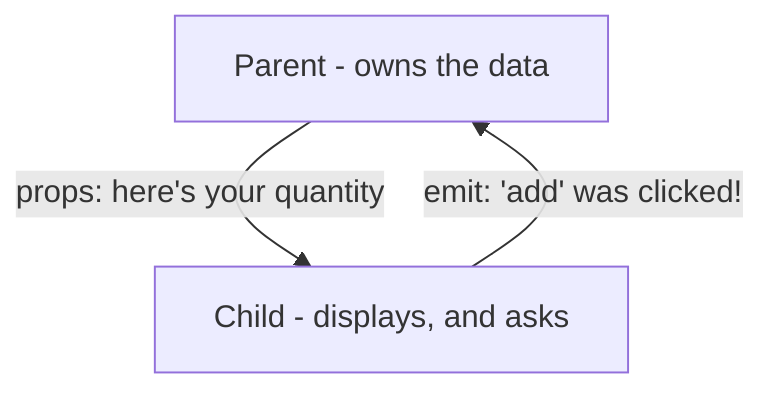

# 3 · Emits - sending events up

> **You'll learn:** how a child component tells its parent something happened - completing "props down, events up", the pattern that structures every Vue app.

## Why this matters

Props got data *into* `ProductRow`, but its + / - buttons hit the one-way wall: the child can see the quantity, but only the parent may change it. Emits are the return channel - the child *announces*, the parent *decides*. Once this clicks, you can read the architecture of any Vue app on sight.

## The big picture



The child declares its events and fires them; the parent listens with the same `@` it uses for clicks:

```vue
<!-- ProductRow.vue -->
<script setup>
defineProps({ name: String, qty: Number })
const emit = defineEmits(['add', 'remove'])
</script>

<template>
  <p>
    {{ name }} ×{{ qty }}
    <button @click="emit('add')">+</button>
    <button @click="emit('remove')">-</button>
  </p>
</template>
```

```vue
<!-- App.vue -->
<template>
  <ProductRow
    name="Coffee" :qty="coffeeQty"
    @add="coffeeQty++"
    @remove="coffeeQty > 0 && coffeeQty--"
  />
</template>
```

Follow one click all the way round: button → child emits `'add'` → parent's `@add` runs → parent's ref changes → new qty flows *down* the prop → row re-renders. Data down, events up, one loop.

## Emits carry payloads

An emit can ship data along with the announcement - arguments after the name arrive in the handler:

```js
// child
emit('add', props.id)                 // "add was clicked - for product 3"
emit('rated', { stars: 4, id: 7 })    // any number of args, any shape
```

```vue
<!-- parent: payload arrives as the handler's argument -->
<ProductRow v-for="p in products" :key="p.id" v-bind="p" :qty="qty[p.id] ?? 0"
  @add="addToCart" />
```

```js
function addToCart(id) {                   // ← the payload
  qty.value[id] = (qty.value[id] ?? 0) + 1
}
```

That's the list pattern completed: *one* handler in the parent, and the payload says which row spoke. (For inline handlers the payload is available as `$event`: `@add="qty[$event]++"` - handy for one-liners.)

## Naming and declaring

- **Declare every event** in `defineEmits([...])` - it's the component's outgoing API, documentation and warning-enabler in one (misspell an emit and Vue tells you, *if* it's declared).
- **Name events after what happened**, not what the parent should do: `@add`, `@selected`, `@search` - not `@update-the-cart`. The child doesn't know or care what the parent does about it; that ignorance is what makes it reusable.

> [!TIP]
> The mental model that scales: a component is a worker with a narrow job description. Props are its *inputs*, emits are its *reports*. It never reaches outside its walls to change things - it reports, and management (the parent) decides. Boring for the worker; wonderful for the org chart.

<details>
<summary>🔍 Deep dive: why not just pass a function down as a prop?</summary>

React people ask this on day one - and yes, `:on-add="someFunction"` as a prop technically works. Vue's dedicated event channel earns its keep three ways: the `@` syntax matches DOM events so templates read uniformly (`@click` on a button, `@add` on a row - same shape); declared emits are inspectable API (Vue devtools shows events firing live - open it and click your buttons); and emits are fire-and-forget by design, so a child can never come to *depend on* what the parent's handler returns - keeping the dependency arrow pointing strictly one way. Same capability, better guardrails.

</details>

## 🛠️ Try it - Snack Cart, componentized (final form)

Finish what lesson 2 started - the TODO comes out today:

1. Give `ProductRow` a `qty` prop and two emits, `add` and `remove`, each carrying the product `id` as payload.
2. In `App.vue`, keep quantities as one object ref (`const qty = ref({})` - keys are product ids) and write `addToCart(id)` / `removeFromCart(id)` handlers. Guard against negatives in *the parent* (it owns the rule, not the row).
3. Reconnect Module 2's computeds - `itemCount`, `total`, `freeShipping` - now deriving from the qty object (`Object.values(qty.value)` and a reduce will do it). Confirm happy hour still halves prices and the totals follow.
4. The payoff tour, out loud: add a fourth product to the array. Count how many files you touched. (One. That's the architecture working.)
5. Devtools bonus: open Vue devtools (browser extension), select a ProductRow, and watch the events panel as you click + and -. Seeing emits fire makes the loop concrete.

<details>
<summary>💡 Hint - deriving from the qty object</summary>

```js
const itemCount = computed(() =>
  Object.values(qty.value).reduce((sum, n) => sum + n, 0)
)
const total = computed(() =>
  products.value.reduce((sum, p) => sum + p.price * (qty.value[p.id] ?? 0), 0)
)
```

</details>

<details>
<summary>✅ Solution - the key wiring</summary>

```vue
<!-- ProductRow.vue -->
<script setup>
defineProps({
  id: { type: Number, required: true },
  name: { type: String, required: true },
  price: { type: Number, required: true },
  emoji: { type: String, default: '🛒' },
  qty: { type: Number, default: 0 }
})
const emit = defineEmits(['add', 'remove'])
</script>

<template>
  <p>
    {{ emoji }} {{ name }} - ${{ price }} ×{{ qty }}
    <button @click="emit('add', id)">+</button>
    <button @click="emit('remove', id)">-</button>
  </p>
</template>
```

```vue
<!-- App.vue (script highlights) -->
<script setup>
const qty = ref({})
function addToCart(id) { qty.value[id] = (qty.value[id] ?? 0) + 1 }
function removeFromCart(id) { if ((qty.value[id] ?? 0) > 0) qty.value[id]-- }
</script>

<template>
  <ProductRow v-for="p in products" :key="p.id" v-bind="p" :qty="qty[p.id] ?? 0"
    @add="addToCart" @remove="removeFromCart" />
  <p>{{ itemCount }} items - ${{ total }}</p>
  <p v-if="freeShipping">🚚 Free shipping!</p>
</template>
```

The row never touches a quantity - it reports clicks with an id attached; the parent owns every rule (including "no negatives"). Props down, events up, complete.

</details>

## ✋ Checkpoint

1. Trace a "-" click through the finished Snack Cart in five arrows, starting at the button and ending at the re-rendered row.
2. A `SearchBox` component should tell its parent what the user searched for. Sketch the `defineEmits` line and the emit call.
3. Your teammate's `DeleteButton` component removes the item from the list *itself* by importing the list module directly. It works. What breaks later, and what's the props/emits redesign?
4. Predict: child emits `'save'` but the parent template has `@saved="..."`. What happens - error, warning, or silence?

<details>
<summary>Answers</summary>

1. button `@click` → `emit('remove', id)` → parent's `@remove` handler → `qty.value[id]--` → new value flows down the `:qty` prop → row re-renders. (Accept any faithful 5-step version.)
2. `const emit = defineEmits(['search'])` and `emit('search', query.value)` - event named for what happened, payload carrying the term.
3. It's welded to that one list - unusable for any other list, untestable alone, and the "who changed the data?" question now has two answers. Redesign: the button emits `'delete'` (maybe with an id payload); whoever owns a list decides what deletion means.
4. Silence - the names don't match, so the handler never runs. No error, no warning; just a button that does nothing. (This is why declared emits + devtools' event panel are your friends when a click mysteriously "does nothing".)

</details>

## 📚 Further reading

- [Component Events - Vue docs](https://vuejs.org/guide/components/events.html) - includes event validation and the casing rules
- [Vue devtools](https://devtools.vuejs.org/) - if you skipped exercise step 5, don't; it's ten minutes that upgrades all future debugging

---

⬅️ [Previous: Props](./02-props.md) · 🏠 [Course home](../README.md) · ➡️ [Next: Slots](./04-slots.md)
