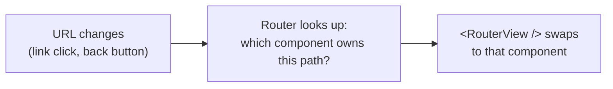

# 1 · Pages and links - from one page to many

> **You'll learn:** how to add Vue Router to a project and turn components into *pages* with real URLs, linked together without ever reloading.

## Why this matters

Everything so far lives at one URL. Real apps have addresses: `/shop`, `/about`, `/orders/42` - bookmarkable, sharable, back-button-friendly. Vue Router provides that while keeping the app a **single-page application**: the browser never actually navigates away; Vue just swaps which component fills the page. Best of both worlds, and the setup takes ten minutes.

## The big picture



Three pieces: a **route table** (path → component), a **`<RouterView>`** (the hole pages render into), and **`<RouterLink>`** (navigation that swaps instead of reloading). Install and wire once per project:

```bash
npm install vue-router@4
```

```js
// src/router/index.js
import { createRouter, createWebHistory } from 'vue-router'
import HomeView from '../views/HomeView.vue'
import ShopView from '../views/ShopView.vue'

export default createRouter({
  history: createWebHistory(),
  routes: [
    { path: '/', component: HomeView },
    { path: '/shop', component: ShopView },
  ],
})
```

```js
// src/main.js - one new line
import router from './router'
createApp(App).use(router).mount('#app')
```

(The scaffold offered to do all this in Module 1 and we said no - deliberately, so today's wiring would make sense. This is exactly what "Add Vue Router?" generates.)

## Views: pages are just components

Convention: page-level components live in `src/views/`, named `SomethingView.vue` - they're ordinary components in every way (`views/` vs `components/` only signals *this one is a page, the router mounts it*). With the table above, `App.vue` becomes the frame around every page:

```vue
<!-- App.vue -->
<script setup>
import AppHeader from './components/AppHeader.vue'
import AppFooter from './components/AppFooter.vue'
</script>

<template>
  <AppHeader />
  <nav>
    <RouterLink to="/">Home</RouterLink>
    <RouterLink to="/shop">Shop</RouterLink>
  </nav>

  <RouterView />       <!-- the current page renders here -->

  <AppFooter />
</template>
```

Whatever's *outside* `<RouterView>` persists across every page - header, nav, footer render once and stay. Whatever's inside swaps per URL. That split - frame vs page - is the architecture of most SPAs you've ever used.

## RouterLink vs plain anchor

```vue
<RouterLink to="/shop">Shop</RouterLink>   <!-- swaps the view - instant, state survives -->
<a href="/shop">Shop</a>                   <!-- full page reload - app restarts, state gone -->
```

`<RouterLink>` renders as a real `<a>` (right-click, open-in-new-tab, all native behaviours intact) but intercepts normal clicks to navigate in-app. Two freebies worth knowing:

- The link matching the current URL automatically gets the class `router-link-active` - style it and your nav highlights itself:

```css
.router-link-active { font-weight: bold; color: #42b883; }
```

- The back and forward buttons just work - the router integrates with browser history (that's the `createWebHistory()` line earning its keep).

> [!WARNING]
> The classic self-sabotage: using `<a href>` for internal links. Everything *seems* fine, but every click reloads the whole app - Pinia state gone, scroll position gone, slow. Internal navigation is always `<RouterLink>` (or lesson 3's programmatic push); bare `<a>` is for *external* URLs only.

<details>
<summary>🔍 Deep dive: what createWebHistory actually does</summary>

How does `/shop` change without a page load? The browser's History API: `history.pushState()` lets JavaScript change the address bar and add history entries without navigating. RouterLink's click handler calls it, then the router renders the matching component - the "navigation" is entirely client-side theatre, which is why it's instant.

The catch comes at the server: if a user *refreshes* on `/shop` (or shares the link), the browser genuinely requests `/shop` from the server - which only has `index.html`. Dev-mode Vite quietly serves index.html for every path, so you won't notice until deployment... which is exactly why Module 8's deploy lesson has a section titled "the refresh 404". There's also `createWebHashHistory()` (`/#/shop` URLs) which dodges the whole issue by hiding the path from the server - uglier, but zero-config on static hosts. File both facts away for the capstone.

</details>

## 🛠️ Try it - the sandbox becomes a site

Restructure `vue-sandbox` into pages:

1. Install `vue-router@4`, create `src/router/index.js` and the `views/` folder. Wire `main.js`.
2. Make three views: `HomeView.vue` (a welcome + your ClickCounter - Module 3's island), `ShopView.vue` (**move the entire Snack Cart** - products, rows, totals - out of App.vue into here), and `PizzaView.vue` (the Module 4 Pizza Builder, if you built it; otherwise any third page).
3. Slim `App.vue` down to the frame: header, nav with three RouterLinks, `<RouterView />`, footer.
4. Style `.router-link-active` so the current page is obvious in the nav.
5. Prove the SPA-ness: add items to the Snack Cart, navigate to Home, come back to Shop. (Cart's empty again? Correct! Page components unmount when you leave - their local refs die with them. Sit with that annoyance: it's Module 6's opening argument.)
6. Prove the reload difference: change one nav link to a plain `<a href="/shop">`, click it, watch the full reload wipe everything. Change it back with feeling.

<details>
<summary>💡 Hint - moving the cart cleanly</summary>

ShopView.vue's script pulls in what App.vue had: the products array, qty object, handlers, computeds, plus the ProductRow/UiCard imports. If you extracted components properly in Module 3, the move is a cut-paste of one script block and one template chunk - that modularity was the point.

</details>

<details>
<summary>✅ Solution - the wiring files</summary>

```js
// src/router/index.js
import { createRouter, createWebHistory } from 'vue-router'
import HomeView from '../views/HomeView.vue'
import ShopView from '../views/ShopView.vue'
import PizzaView from '../views/PizzaView.vue'

export default createRouter({
  history: createWebHistory(),
  routes: [
    { path: '/', component: HomeView },
    { path: '/shop', component: ShopView },
    { path: '/pizza', component: PizzaView },
  ],
})
```

```js
// src/main.js
import { createApp } from 'vue'
import App from './App.vue'
import router from './router'

createApp(App).use(router).mount('#app')
```

App.vue: exactly the frame from the lesson, with the third RouterLink added.

</details>

## ✋ Checkpoint

1. What renders where: user is at `/shop` - which parts of App.vue's template are visible, and which component fills `<RouterView>`?
2. Predict each click: (a) `<RouterLink to="/pizza">` (b) `<a href="/pizza">` (c) browser back button after (a). Which ones reload the app?
3. Why do page components conventionally live in `views/` when they're technically ordinary components?
4. Your nav's Shop link stays bold even on the Home page. What class were you styling, and what's the likely bug? (Hint: `/` matches *inside* `/shop`... look up `router-link-exact-active`.)

<details>
<summary>Answers</summary>

1. Everything outside RouterView (header, nav, footer) plus ShopView inside it - frame persists, page swaps.
2. (a) instant in-app swap, no reload. (b) full reload, state wiped. (c) instant swap back - history entries from pushState behave like real navigation, minus the reload.
3. Pure signal for humans: "the router mounts this; don't reuse it as a child component". The folder split documents the frame-vs-page architecture.
4. You styled `router-link-active`, which uses *prefix* matching - the `/` link is "active" on every page since every path starts with `/`. Style `router-link-exact-active` for the home link (or use exact matching), a rite of passage every Vue dev hits once.

</details>

## 📚 Further reading

- [Vue Router: Getting Started](https://router.vuejs.org/guide/) - the official version of this lesson
- [History API - MDN](https://developer.mozilla.org/en-US/docs/Web/API/History_API) - the browser feature under the hood, if the deep dive intrigued you

---

⬅️ [Module home](./README.md) · 🏠 [Course home](../README.md) · ➡️ [Next: Dynamic routes](./02-dynamic-routes.md)
