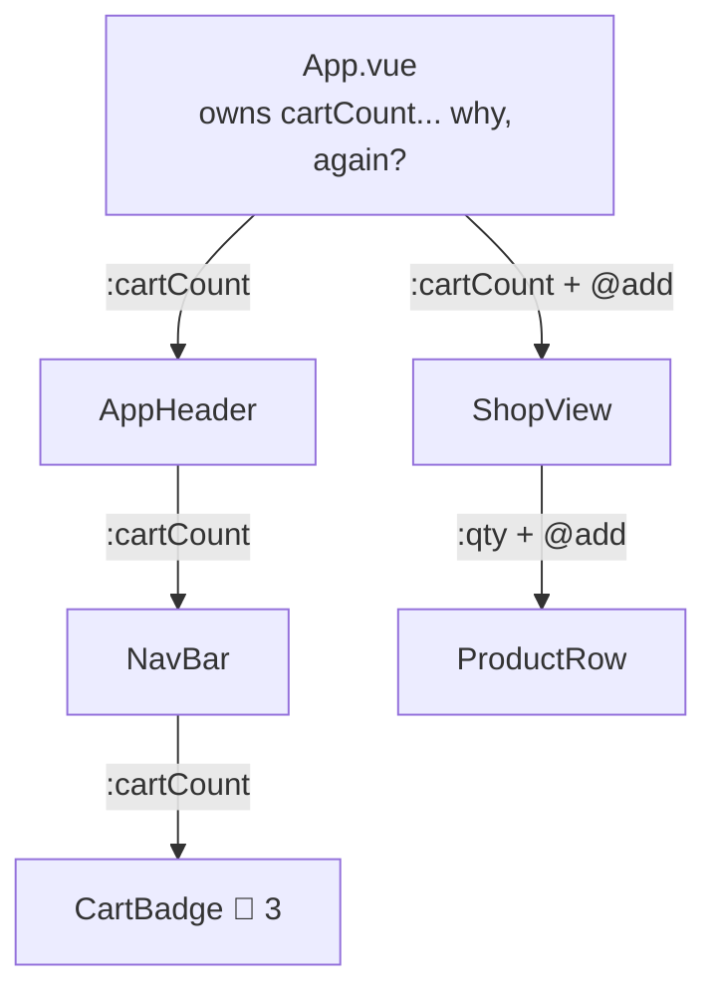

# 1 · The prop-drilling problem - why stores exist

> **You'll learn:** to recognise the moment "props down, events up" stops scaling - and what the escape hatches are, so Pinia arrives as a relief instead of a ritual.

## Why this matters

Module 3's pattern is right for components talking to their parents. But some state is *everybody's* - the cart, the logged-in user, the theme - and routing (Module 5) made it worse: state died every time a page unmounted, and you smuggled a cart total through a *query string*. Before installing the fix, it's worth twenty minutes truly understanding the disease; engineers who skip this step put everything in stores and create a different mess.

## The big picture

The cart count needs to show in the header. The header is nowhere near the cart:



To connect CartBadge and ProductRow - five components apart - *every* component on the path must accept and re-pass props (and re-emit events back up!) for data it doesn't use. That's **prop drilling**, and its costs compound:

- **Middlemen bloat**: NavBar's props are 80% freight it never opens.
- **Brittle refactors**: moving CartBadge means re-plumbing every layer above it.
- **The wrong owner**: App.vue accumulates state it has no business owning, purely because it's everyone's ancestor.
- **Death by navigation**: page components unmount on route change - state living in a *view* just dies (your Snack Cart, every time you visited Home).

## The escape hatches, ranked

| Tool | What it is | Right when |
|---|---|---|
| Lift state up | move the ref to the closest common parent | the components are *near* each other - this is fine and normal |
| provide / inject | a parent publishes a value; any *descendant* grabs it directly | one subtree needs it - a form's config, a theme for a widget tree |
| **A store (Pinia)** | state that lives *outside* the component tree; anyone imports it | truly app-wide: cart, user, settings - especially across *routes* |

`provide`/`inject` deserves its two lines of syntax - it's built into Vue, no install:

```js
// ancestor
import { provide } from 'vue'
provide('theme', theme)          // any descendant, however deep...
```

```js
// ...descendant, skipping every middleman
import { inject } from 'vue'
const theme = inject('theme')
```

Real limitation: it follows the *component tree* - two sibling pages under RouterView can't share state through it (the value would have to live above the router view... and you're back to App.vue-as-junk-drawer). For cross-page state, the tree itself is the wrong shape.

## The actual insight

Here's the reframe the whole module rests on: **the component tree is for UI. Some state is not UI-shaped.** A cart isn't "part of the shop page" - the header needs it, the checkout needs it, a future orders page needs it, and it must outlive all of them. Forcing it to live inside some component - any component - is a category error. It wants to live *outside* the tree, as a module any component can import.

You even proved the shape works already: Module 5 moved the *products array* to `src/data/products.js`, and both list and detail pages imported it painlessly. A store is that move, for *reactive, changing* state - plus devtools, conventions, and organization. Which is next lesson.

> [!TIP]
> The test that decides for you: *"If this component unmounted, should this state survive?"* Cart contents: obviously. Which accordion section is open: obviously not. Everything in this module flows from asking that question honestly.

<details>
<summary>🔍 Deep dive: could a plain shared ref do it?</summary>

Yes - and knowing why it works makes Pinia unmysterious:

```js
// src/state/cart.js - no library, works today
import { ref } from 'vue'
export const cartCount = ref(0)
```

Any component imports `cartCount` and it's shared, reactive, route-proof - refs don't care where they live (Module 2 never said "must reside inside a component"). Small apps genuinely ship this. What Pinia adds over loose refs: a place for the *logic* (actions/getters, next lesson) so twenty components don't each mutate raw state their own way; devtools that show state, history, and time-travel; conventions a teammate recognises on sight; and lifecycle/SSR safety in bigger setups. Pinia is "the shared-ref pattern, industrialized" - same insight, better guardrails.

</details>

## 🛠️ Try it - feel the drill (then the relief)

This exercise is deliberately annoying - that's the pedagogy:

1. Give the sandbox a `CartBadge.vue` (🛒 + a count) and put it in `AppHeader`'s nav area. Now make it show ShopView's real `itemCount`... using props/emits only. You'll have to *lift* the cart state (qty object, handlers, computeds) out of ShopView into App.vue, then drill: `:item-count` into AppHeader → into the badge, and the qty/handlers *down into ShopView* as props + events. Get it compiling and working. Count the files you touched and the props that are pure freight.
2. Notice what else just happened: with cart state lifted to App.vue, visiting Home no longer wipes the cart (App never unmounts!). Lifting *did* fix the route-death problem - at the cost of App.vue becoming the junk drawer. Write both halves of that trade in a comment.
3. Try the deep dive's loose-ref version on a branch of your thinking (or actually): `src/state/cart.js` with the qty ref exported; ShopView and CartBadge import it directly; App.vue returns to pristine. Feel the middlemen vanish.
4. Write down (really - a comment in cart.js) your app's answer to the survival test for: cart contents, the Pizza form's touched-flags, the current route's product id. One should say "store", two should say "local". Keep the comment; lesson 3 grades it.

<details>
<summary>💡 Hint - what step 1 should feel like</summary>

Roughly: 5-6 files touched, AppHeader and NavBar (if you have one) gaining props they never read, ShopView demoted from owner to renderer. If it feels tedious and slightly indignant - correct, proceed. If it feels fine, your tree is still shallow; imagine it at two more layers.

</details>

<details>
<summary>✅ Solution - the loose-ref version (step 3)</summary>

```js
// src/state/cart.js
import { ref, computed } from 'vue'

export const qty = ref({})
export const itemCount = computed(() =>
  Object.values(qty.value).reduce((s, n) => s + n, 0)
)
export function addToCart(id) { qty.value[id] = (qty.value[id] ?? 0) + 1 }
export function removeFromCart(id) { if ((qty.value[id] ?? 0) > 0) qty.value[id]-- }
```

```vue
<!-- CartBadge.vue - no props at all -->
<script setup>
import { itemCount } from '../state/cart'
</script>
<template><span>🛒 {{ itemCount }}</span></template>
```

ShopView imports qty/handlers the same way; App.vue carries nothing. This *is* essentially a store - lesson 2 gives it the proper uniform.

</details>

## ✋ Checkpoint

1. Define prop drilling in one sentence, and name the two costs you personally hit in step 1.
2. Why can't `provide`/`inject` share the cart between ShopView and a future OrdersView?
3. Sort by the survival test - store or local: (a) logged-in user, (b) "is this dropdown open", (c) cart contents, (d) the search box's current text on a search page.
4. From the deep dive: name two things Pinia adds over an exported ref in a module.

<details>
<summary>Answers</summary>

1. Passing props through components that don't use them, just to reach a distant descendant - typical costs: freight props on middlemen, and refactors that re-plumb whole paths (accept any two honest ones).
2. They're sibling subtrees under RouterView - inject only reaches *descendants* of the provider, so the provider would have to sit above the router view, i.e. App.vue owns it again.
3. (a) store (b) local (c) store (d) defensible either way - local until another component (results header? URL sync?) needs it; the honest answer is "local, promote when proven". Credit for reasoning, not the letter.
4. Any two of: a home for actions/getters, devtools with state history, recognisable conventions, SSR/lifecycle safety.

</details>

## 📚 Further reading

- [provide / inject - Vue docs](https://vuejs.org/guide/components/provide-inject.html) - the middle escape hatch, done properly
- [Pinia: Introduction](https://pinia.vuejs.org/introduction.html) - read "Why should I use Pinia" tonight; tomorrow you install it

---

⬅️ [Module home](./README.md) · 🏠 [Course home](../README.md) · ➡️ [Next: Your first Pinia store](./02-your-first-pinia-store.md)
