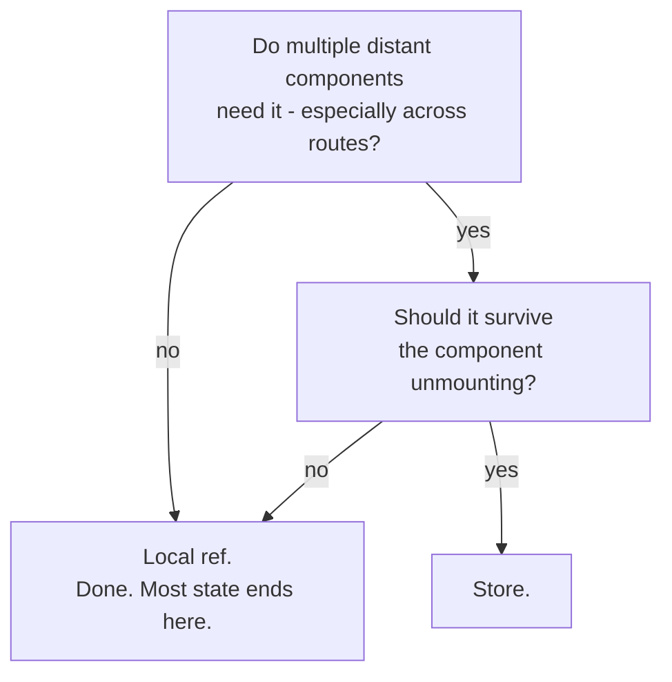

# 3 · What goes in the store (and what doesn't)

> **You'll learn:** the judgment layer - deciding what belongs in a store, keeping components thin without hollowing them out, and structuring stores as apps grow.

## Why this matters

Pinia's mechanics took one lesson; careers' worth of messes come from the *judgment*. Put too little in stores and you're back to drilling; put everything in and you've built a global-variable soup where any file mutates anything and no bug has an address. The teams that stay fast are the ones with taste about this line - and taste can be taught.

## The big picture

Three questions, asked in order, sort any piece of state:



And the honest defaults behind them:

| Belongs in a store | Stays local |
|---|---|
| cart contents | which dropdown is open |
| logged-in user, auth token | form drafts and touched-flags |
| app settings (theme, locale) | hover/focus states |
| data caches shared across pages (Module 7) | a page's transient filter text* |

*until proven otherwise - promotion is cheap, and premature promotion is the actual mistake.

> [!TIP]
> Default local. State earns its way *into* a store by demonstrated need (a second distant consumer, or death-by-navigation pain) - never "just in case". A ref promoted later is a ten-minute refactor; a store demoted later means auditing every file that might touch it.

## Fat stores, thin components

Once state lives in a store, the *rules about it* belong there too. Compare who enforces "quantities never go negative":

```js
// ❌ every component its own judiciary
function onRemoveClick(id) {
  if ((cart.qty[id] ?? 0) > 0) cart.qty[id]--     // copy-pasted rule, n places, until one forgets
}
```

```js
// ✅ the store owns its own laws
cart.remove(id)                                    // callers can't get it wrong
```

The principle: **components ask, stores decide**. A component translates user intent into an action call; the action holds the invariants, and getters hold the derivations. Two payoffs arrive immediately - the rule exists exactly once, and devtools' action timeline becomes a true audit log of every state change (a component writing `cart.qty[id] = -3` directly would bypass both). Some teams formalise it as "never mutate store state outside the store"; even uncodified, it's the professional instinct.

This also settles where side effects go: Module 2's localStorage watcher for the cart? *In the store's setup function* - stores can use `watch` like any setup code. Persistence is a law about the cart, so it lives with the cart.

## More than one store

Stores are per-*domain*, not per-app - the capstone and real projects run several:

```
src/stores/
├── cart.js        ← useCartStore
├── user.js        ← useUserStore
└── settings.js    ← useSettingsStore
```

Split when a store accumulates unrelated concerns (the test: would a change to one half ever care about the other?). Stores can use each other - an orders store calling `useUserStore()` inside an action to stamp who ordered - it composes exactly as components do. Avoid two stores *both* owning the same fact; every fact gets one home, the rest derive.

<details>
<summary>🔍 Deep dive: the smells, named</summary>

Field guide for code review, yours or others':

- **The God store**: one store named `app` or `main` holding cart + user + UI flags + whatever Tuesday brought. Split by domain; the filename should predict the contents.
- **Store-as-mailbox**: two components using a store field purely to signal each other once ("setFormShouldReset(true)"... then the other sets it false). That's an event wearing state's clothes - usually wants an emit, a watcher on real state, or a direct action call.
- **UI state in exile**: `isProductModalOpen` in the cart store because two components mention it. Modal-openness is view state; keep it with the view (or a dedicated ui store *if* it's genuinely cross-cutting, like a global toast queue).
- **The pass-through getter**: `getQty: () => qty` - a getter that derives nothing. Expose the state; getters are for *derivation*.
- **Fetch soup** (previewing Module 7): every component fetching the same list itself instead of a store action caching it. The store is exactly where shared server data wants to live - next module builds this properly.

</details>

## 🛠️ Try it - the audit and the second store

Judgment reps, on your real sandbox:

1. Grade lesson 1's survival-test comment (you left one in cart.js, or write it fresh): cart contents, pizza-form touched flags, current route's product id. Check against the flowchart - then delete the comment and replace it with the flowchart's two questions, as a checklist for future-you.
2. Move Module 2's persistence into the store: a `watch` on `qty` (deep!) inside the setup function, saving to localStorage; initialise the ref from storage. The cart now survives *reloads*, not just navigation - and the persistence law lives with the state it governs.
3. Build `src/stores/settings.js`: a `theme` ref (`'light'`/`'dark'`), a `toggle()` action, persistence, and - the store-side effect pattern again - a watcher applying `document.body.className`. Wire a toggle button into AppHeader. Two stores, zero interference.
4. Thin-component pass: hunt ShopView and ProductRow for any surviving cart *logic* (a stray `?? 0` guard, a negative check). Relocate rules into actions/getters until components only ask and render. Read the diff - that's what "components ask, stores decide" looks like in practice.
5. Smell hunt, thirty seconds each: does your cart store contain anything UI-shaped? Does anything outside `stores/` mutate `cart.qty` directly? Clean or convict.

<details>
<summary>💡 Hint - persistence inside a setup store</summary>

```js
export const useCartStore = defineStore('cart', () => {
  const qty = ref(JSON.parse(localStorage.getItem('cart') ?? '{}'))

  watch(qty, (q) => localStorage.setItem('cart', JSON.stringify(q)), { deep: true })
  // ...rest unchanged
})
```

Module 2's exact pattern, new address. The `deep` is still load-bearing.

</details>

<details>
<summary>✅ Solution - settings store</summary>

```js
// src/stores/settings.js
import { defineStore } from 'pinia'
import { ref, watch } from 'vue'

export const useSettingsStore = defineStore('settings', () => {
  const theme = ref(localStorage.getItem('theme') ?? 'light')

  function toggle() { theme.value = theme.value === 'light' ? 'dark' : 'light' }

  watch(theme, (t) => {
    localStorage.setItem('theme', t)
    document.body.className = t
  }, { immediate: true })      // immediate: apply the stored theme on startup - Module 2's exact judgment call

  return { theme, toggle }
})
```

AppHeader: `<button @click="settings.toggle()">{{ settings.theme === 'light' ? '🌙' : '☀️' }}</button>` plus a little `body.dark { ... }` CSS to prove it. Note what this store *doesn't* contain: nothing about carts, nothing about any specific page.

</details>

## ✋ Checkpoint

1. Run the flowchart aloud on: (a) a global toast/notification queue, (b) "which image in the product gallery is zoomed", (c) the user's saved shipping address.
2. A teammate writes `cart.qty[id] = 0` directly inside a DeleteButton component. It works. Make the case against it in two sentences.
3. Your `settings` store has grown fields for `theme`, `locale`, `cartBadgeAnimation`, and `lastVisitedProduct`. Which one doesn't belong, and where does it go?
4. Store, local, or "local until proven": a search page's query text that, next sprint, the URL should reflect and a results-count header should read.

<details>
<summary>Answers</summary>

1. (a) store - distant consumers (any component toasts, one component renders them), survives navigation. (b) local - dies with the gallery, nobody else cares. (c) store (likely `user`) - multiple pages, must survive.
2. It bypasses the store's laws (no validation, no single home for the rule) and devtools' audit trail - the next "how did qty become -3?" bug now has no suspect list. `cart.remove(id)` or a `setQty` action keeps every change accountable.
3. `lastVisitedProduct` - it's navigation/history state, not a setting; it belongs wherever it's used (likely local, or a future browsing-history store if multiple features need it). Defensible bonus answer: `cartBadgeAnimation` smells UI-in-exile too if only the badge reads it.
4. "Local until proven" was last sprint's answer; the new requirements *are* the proof - two consumers plus URL sync means promote (and Module 5's query strings handle the URL half: `router.replace({ query: { q } })` from a watcher).

</details>

## 📚 Further reading

- [Pinia: when to use a store](https://pinia.vuejs.org/cookbook/composables.html#when-to-use-a-store) - the official line-drawing advice
- [Pinia cookbook](https://pinia.vuejs.org/cookbook/) - migrations, composition, testing - skim the menu so you know what exists

---

⬅️ [Previous: Your first Pinia store](./02-your-first-pinia-store.md) · 🏠 [Course home](../README.md) · ➡️ Next: [Module 7 · Talking to APIs](../module-07-talking-to-apis/)
