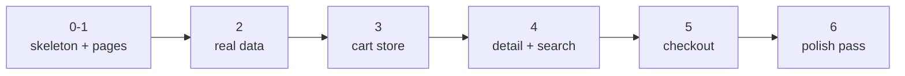

# 2 · The build - guided checkpoints, mostly you

> **You'll learn:** nothing new - deliberately. This lesson is the course's skills executed end to end by you, with checkpoints to keep the build honest and hints where the seams are.

## Why this matters

Following lessons builds understanding; building *without* one builds capability - and capability is what you hired this course for. The safety net: every checkpoint below names its module, so being stuck is never a wall, just an address. Budget a few sessions, not one sitting.

## The big picture

Build in vertical slices, not layers - after every checkpoint the app *runs and does more than before*. The order is chosen so each stage's plumbing is ready when the next needs it:



Work with PLAN.md open. When reality disagrees with it, update the plan (one line) and continue - that's the plan working, not failing.

## The checkpoints

**☐ 0 · Scaffold** - `npm create vue@latest snackmart` - and this time, when it offers Router and Pinia... *still say no*, then add them yourself (Modules 5 and 6 showed every wire; doing it once more from memory is the point of a capstone). Git init, commit. Commit at every checkpoint hereafter - future-you debugging checkpoint 5 wants a working checkpoint 4 to diff against.

**☐ 1 · Frame and pages** *(Modules 3, 5)* - App.vue as frame (header with nav, RouterView, footer), all six routes from your plan rendering placeholder headings, 404 included. Acceptance: click through every page; refresh on a deep URL; nothing console-errors; active nav link styled.

**☐ 2 · Real products** *(Module 7)* - port `useFetch` (and the debounced-ref composable) from the sandbox - yes, copying your own composables between projects is the professional move; that's what they're *for*. CatalogView: grid of ProductCards from the API with all four lanes. Acceptance: throttle to Slow 4G and sabotage the URL - loading, error+retry, and empty all reachable; then un-sabotage.

**☐ 3 · The cart** *(Modules 6, 2)* - cart store: qty map, add/remove/setQty/clear actions, itemCount/total getters, localStorage persistence in-store. CartBadge in the header; add-buttons on ProductCards (emit → view → store, the full bucket brigade). CartView with editable rows. Acceptance: add from catalog, edit in cart, reload the browser, count survives; devtools' Pinia timeline shows actions, not raw mutations.

> One honest wrinkle vs the sandbox: `total` can't import a static products file anymore - the products live on an API. Simplest correct fix: store `{ id, title, price, qty }` per cart line (capture price at add time - which is *also* how real shops avoid mid-cart price changes). Your plan may already have said this; if not, one-line update.

**☐ 4 · Detail + search** *(Modules 5, 7, 4)* - ProductView fetching `/products/:id` via a getter URL off `route.params` (the composition the plan flagged: param changes → refetch - test with next/prev links or two catalog clicks). StarRating displays `product.rating` (read-only use of your Module 4 component - `:model-value` without the update wire is legal and occasionally right). SearchBar on the catalog, debounced. Acceptance: deep-link a product URL in a fresh tab; search "zzz" hits the empty lane; `/products/9999` lands on the 404 via replace.

**☐ 5 · Checkout** *(Module 4)* - the form per your plan: name/email/etc., validation-as-computeds, touched-politeness, QtyStepper somewhere honest, submit disabled-until-valid, success view that shows a summary and calls `cart.clear()`. Acceptance: the Module 4 torture test (empty-submit via Enter, fix-one-field, boundary quantities) plus: checkout with an empty cart should be impossible to reach gracefully (your choice how - guard, redirect, or disabled link; say why in a comment).

**☐ 6 · Polish pass** - the difference between "exercise" and "thing I'd share": a real HomeView (fetch 4 featured products), the 404 with personality, `document.title` per page (a `watch` on `route` - Module 2's oldest trick, app-wide), empty-cart and cleared-cart states with friendly copy, and one console-warning sweep (missing `:key`s and prop-type gripes count). Acceptance: hand your phone... browser window... to someone and watch them use it without you narrating.

<details>
<summary>🔍 Deep dive: when you get stuck - the debugging ladder for Vue apps</summary>

Capstone-stuck is different from lesson-stuck: no solution block. The ladder that finds most bugs, in order: **1)** the console (warnings you've been ignoring are clues now); **2)** Vue devtools - inspect the actual component's actual props/refs (is the data wrong, or the render?), and the Pinia timeline (did the action fire?); **3)** the Network tab (did the request happen? what *really* came back?); **4)** binary search - comment out half the template, does it still break?; **5)** re-read the relevant lesson's Checkpoint answers - they were written from these exact bugs. And the meta-rule: after twenty minutes truly stuck, take a walk. The bug is usually visible from the door on the way back in.

</details>

## 🛠️ Try it

The checkpoints *are* the exercise. Two process rules and one stretch:

1. **Commit per checkpoint** with a message naming it ("checkpoint 3: cart store + badge"). The log becomes your progress bar - and lesson 3 deploys from a clean history.
2. **Keep a SNAGS.md** - every time you're stuck >10 minutes, one line: what happened, what fixed it. This file ends up more valuable than the app; it's *your* course notes, written by the only author who knows exactly what confused you.
3. Stretch goals, only after checkpoint 6, in value order: category filter buttons on the catalog (query strings, Module 5's deep dive); a "recently viewed" strip on Home (a store + ProductView reporting visits - argue the store/local case first); dark mode via your settings store; an interactive StarRating on the detail page that saves ratings locally ("your rating: ★★★★☆").

<details>
<summary>💡 Hint - the cart-line shape for checkpoint 3</summary>

```js
// stores/cart.js - lines keyed by id
const lines = ref(JSON.parse(localStorage.getItem('cart') ?? '{}'))

function add(product) {                       // note: the whole product, not just id
  const line = lines.value[product.id]
  if (line) line.qty++
  else lines.value[product.id] = { id: product.id, title: product.title, price: product.price, qty: 1 }
}
const total = computed(() =>
  Object.values(lines.value).reduce((s, l) => s + l.price * l.qty, 0)
)
```

ProductCard's emit changes from `@add="cart.add(p.id)"` to `cart.add(p)` - the event now carries the product. Everything else follows.

</details>

<details>
<summary>✅ Definition of done</summary>

All six checkpoints ticked, each with a commit; every requirement row from lesson 1's table demonstrably true in the running app; PLAN.md updated where reality won; SNAGS.md non-empty (an empty one means the goals were too easy - stretch); and the app survives five minutes of someone else driving. Lesson 3 takes it from `localhost` to a URL you can text to people.

</details>

## ✋ Checkpoint

The build was the checkpoint. Three reflection questions for SNAGS.md's last section, no answers block - these are yours:

1. Which module's skill turned out weakest under pressure, and which lesson do you owe a re-skim?
2. What did you change from PLAN.md, and would better planning have caught it - or was it honestly undiscoverable until you built?
3. What would you build next with this stack, now that you know the cost of each part?

## 📚 Further reading

- Your own SNAGS.md - genuinely the most personalised Vue reference that exists
- [Vue devtools docs](https://devtools.vuejs.org/) - ten minutes on the timeline features pays off across every future project

---

⬅️ [Previous: Planning the app](./01-planning-the-app.md) · 🏠 [Course home](../README.md) · ➡️ [Next: Build and deploy](./03-build-and-deploy.md)
