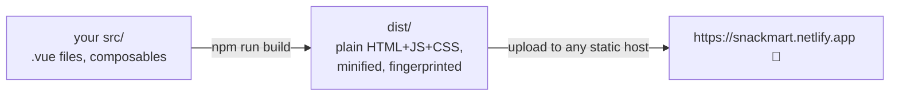

# 3 · npm run build and deploying to the web

> **You'll learn:** what `npm run build` actually produces, the one router gotcha every SPA hits on static hosting, and how to put Snackmart at a real URL - the course's finish line.

## Why this matters

An app on `localhost` exists for exactly one person. The gap between "works on my machine" and "here's the link" is smaller than it looks - one build command, one host, one gotcha - and crossing it transforms the capstone from an exercise into a *thing you made* that lives on the internet. That psychological upgrade is worth more than any lesson in this course.

## The big picture



```bash
npm run build      # Vite compiles and minifies everything into dist/
npm run preview    # serve dist/ locally - test the REAL build before shipping
```

Look inside `dist/` (module 1's tour, closing the loop): `index.html` plus `assets/index-D2xK9fQ3.js` and a `.css` sibling. Your entire app - every component, the router, Pinia, Vue itself - compiled into a few static files. **No server code**: this is why hosting is free and trivial. The gibberish in filenames is a *content hash* - change the code, the name changes, so browsers cache aggressively yet never serve stale apps.

> [!NOTE]
> The dev server compiled on demand; `build` compiles everything ahead of time with production switches on (minified, no dev warnings, tree-shaken - unused code deleted). `preview` exists because the two modes *can* differ - thirty seconds of preview beats debugging in production.

## The SPA gotcha, prophesied in Module 5

Module 5's deep dive planted this flag; deployment is where it flies. A user visits your deployed `/products/3` directly (or refreshes there): the browser asks the *server* for `/products/3` - and the server has exactly one page, `index.html`. Result: a hosting-provider 404 before Vue ever loads. Dev mode hid this by always serving index.html; production hosts need to be *told*:

```text
# public/_redirects  (Netlify - one line, ships inside dist/ automatically)
/*  /index.html  200
```

"Whatever path they ask for, serve index.html" - then Vue boots, the router reads the URL, and your page (or your 404 view, for genuinely bad paths) renders. Every static host has an equivalent (Vercel calls them rewrites; GitHub Pages needs a `404.html` copy trick); the search term is **"SPA fallback"**. Test after deploying: refresh on a product page. If you see *your* charming 404 or the product - correct; the host's plain 404 - the fallback isn't wired.

## Shipping it

Two beginner-proof paths; pick one:

**Netlify Drop** (fastest first ship): `npm run build`, then drag the `dist/` folder onto [app.netlify.com/drop](https://app.netlify.com/drop). URL in ~10 seconds. (Add the `_redirects` file to `public/` *before* building so it ships.)

**Git-connected deploy** (the professional loop): push snackmart to GitHub, then on Netlify/Vercel: "import repository", build command `npm run build`, output `dist`. Every future `git push` auto-deploys - continuous deployment, the way real teams ship, free tier, five minutes.

(GitHub Pages also works and is free forever; its quirks - the `base` path in `vite.config.js` when hosted under `/repo-name/`, and the 404.html fallback dance - make it the third choice for a first deploy. The docs link below covers it when you want it.)

Then the finish-line ritual, genuinely: send the URL to someone. Watch them use it on their phone. Fix the one thing they immediately find (there's always one). Ship the fix with a push. *That loop is the job* - you've now done all of it.

<details>
<summary>🔍 Deep dive: what "static" hosting can and can't do - and what's next</summary>

Snackmart is a static SPA: all logic ships to the browser; the only server involved is dummyjson's. That architecture covers a huge slice of real apps (dashboards, catalogs, tools over existing APIs) - and its edges define your next learning steps when you hit them. **Secrets** can't live in a static app (every "secret" in dist/ is public - view-source proves it), so real API keys need a thin backend or serverless function. **Writing shared data** needs a real API of your own - the moment two users must see each other's changes, someone needs a database (a backend framework, or a service like Supabase/Firebase). **SEO/instant first paint** at scale wants server-side rendering - in Vue-land that's **Nuxt**, which is to Vue what a full kitchen is to your excellent camp stove: same ingredients, same recipes (components, composables, stores - everything transfers), more machinery. When a project needs one of these three, that's not this course failing - that's you graduating past its scope, on schedule.

</details>

## 🛠️ Try it - ship it

The final exercise of the course:

1. Add the `_redirects` file to `public/`, `npm run build`, and spelunk `dist/` for two minutes - find your app's JS, note the total size (Vue + your whole app typically lands well under 200 KB gzipped; you built something *fast*).
2. `npm run preview` and do one full clickthrough of the real build - catalog, detail, cart, checkout, 404.
3. Deploy (either path). Then the acceptance tests *on the live URL*: deep-link a product in a private window; refresh on it; break the URL for your 404; complete a checkout; check it on a phone.
4. The ritual: send it to a human. Collect the one thing. Fix, push (or re-drag), confirm live.
5. Close the loop on the whole course: in your course repo, tick every module checkbox in the [course home](../README.md) - including this one - and paste your live URL at the top of your PLAN.md as a trophy.

<details>
<summary>💡 Hint - if the deployed page is blank</summary>

Nine times out of ten on a first deploy: assets 404ing because the app is served from a subpath (GitHub Pages' `/repo-name/`) without `base: '/repo-name/'` in `vite.config.js` - the browser console says so plainly. The tenth time: you dragged the project folder instead of `dist/`. Both are two-minute fixes; neither means anything is wrong with your app.

</details>

<details>
<summary>✅ Definition of shipped</summary>

A URL that strangers can open; deep links and refreshes land correctly; the checkout works on a phone; and at least one other human has used it. Screenshot the moment - first deploys only happen once.

</details>

## ✋ Checkpoint

The last one in the course:

1. What's in `dist/`, in one sentence - and why does that make hosting free?
2. Explain the refresh-404 to a colleague in two sentences: why dev mode never showed it, and what the `_redirects` line tells the host.
3. Your deployed app must now use a paid weather API with a secret key. Why can't the key ship in the Vue app, and what shape of fix does the deep dive point at?
4. Someone asks "so you know Vue now?" - list what a yes honestly covers, module by module, from memory. (Do it - the list is longer than you think, and you built evidence for every line.)

<details>
<summary>Answers</summary>

1. Plain, minified, content-hashed HTML/JS/CSS - no server code to run, so any file-serving CDN can host it, and file-serving is nearly free.
2. Dev-mode Vite serves index.html for every path automatically; a production static host serves *files*, and `/products/3` isn't one. The `_redirects` line says "serve index.html for any path" so the router can take over client-side.
3. Everything in dist/ is sent to every visitor - view-source *is* the app; a key there is published, not stored. Fix shape: a tiny backend/serverless function that holds the key and proxies the request.
4. Reactivity (refs/computed/watch), components (props/emits/slots/v-model), forms + validation, routing (dynamic, programmatic, 404s), Pinia stores with judgment, API fetching with honest states, composables, and a planned/built/deployed app. That's a "yes".

</details>

## 📚 Further reading

- [Vite: Deploying a Static Site](https://vite.dev/guide/static-deploy.html) - every host's recipe, including the GitHub Pages base-path dance
- [Nuxt](https://nuxt.com/) - when a future project needs SSR; your skills transfer nearly whole

---

## 🎓 That's the course

From "what's a framework?" to a deployed, API-driven, state-managed app that someone else has used - built the way Vue is written today. The [course home](../README.md) has the full map of what you now know; the further-reading links you skipped are excellent next weekends, and Nuxt is there when a project demands it. Mostly, though: build the next thing. You have the stack, the plan template, and a `useFetch` with your name on it.

⬅️ [Previous: The build](./02-the-build.md) · 🏠 [Course home](../README.md)
